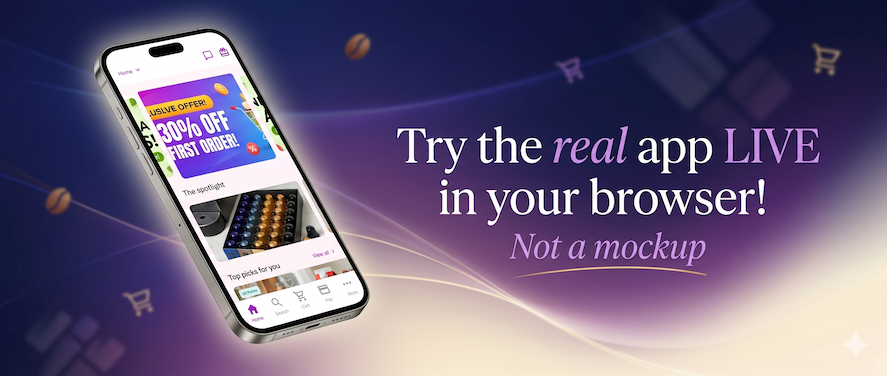

<div align="center">


<br/>

# Breadfast — Flutter UI Clone
### This project was originally created on **May 2025** , just repolished to be showcased alongside my other projects in my portfolio .

**A pixel-faithful, production-structured Flutter clone of the real [Breadfast](https://www.breadfast.com/) grocery delivery app.**  
Built for a Frontend Mobile Development (UI/UX Flutter) university course.


<p align="center">
    <a href="https://lynx1097.github.io/breadfast-clone/">
      
    </a>
</p>
</div>

> [!NOTE]
> Not a mockup means this app is a real app not an HTML/CSS look-alike , but its still a Breadfast mockup with no real buying functions or real wallets , the accounts and database retrieved content is real though (firebase) .
 
<div align="center">
<br/>


</div>

---

## Overview

This project replicates the complete look, feel, and user journey of the Breadfast grocery delivery app — from the onboarding splash through browsing, searching, and cart management — built entirely from scratch in Flutter with Firebase Realtime Database as the live backend.

Every screen, layout, animation, color, typography choice, and interaction was reverse-engineered by studying the real app and implemented manually without any UI kits or templates.

---

## Screenshots

<table>
  <tr>
    <td align="center"><b>Select Country</b></td>
    <td align="center"><b>Phone Auth</b></td>
    <td align="center"><b>Sign Up</b></td>
    <td align="center"><b>Home Feed</b></td>
  </tr>
  <tr>
    <td></td>
    <td></td>
    <td></td>
    <td></td>
  </tr>
  <tr>
    <td align="center"><b>Product Detail Sheet</b></td>
    <td align="center"><b>Category View</b></td>
    <td align="center"><b>Category Switcher</b></td>
    <td align="center"><b>Search</b></td>
  </tr>
  <tr>
    <td></td>
    <td></td>
    <td></td>
    <td></td>
  </tr>
  <tr>
    <td align="center"><b>Cart</b></td>
    <td align="center"><b>Wallet / Pay</b></td>
    <td align="center"><b>Profile & More</b></td>
    <td></td>
  </tr>
  <tr>
    <td></td>
    <td></td>
    <td></td>
    <td></td>
  </tr>
</table>

---

## Features

### 🔐 Authentication Flow
- **Country Selection** — Egypt / Saudi Arabia picker with flag emojis, purple highlight on selection, and a disabled Continue button until a country is chosen — matching the real app's onboarding UX exactly
- **Phone Number Entry** — `+20` country code prefix, real-time 10-digit validation with a live green checkmark, and a Terms & Privacy Policy rich-text footer with tappable links
- **Smart Routing** — on Continue, the app queries Firebase to detect whether the phone number belongs to an existing user and routes to **Login** (Password screen) or **Sign Up** automatically
- **Sign Up Form** — inline side-by-side First / Last name fields, password + confirm with mismatch validation, purple focus borders, and a `Create account` button that stays disabled until all fields are valid
- **Session Persistence** — login state stored via `SharedPreferences`; the Splash screen reads this on every launch and deep-links directly into the app shell, skipping onboarding entirely

### 🏠 Home Screen
- **Promotional Banner Carousel** — auto-playing `carousel_slider` with infinite scroll, center-page enlargement, and rounded-corner image cards loaded from Firebase
- **The Spotlight** — horizontally scrollable wide-card section for featured editorial content
- **Top Picks For You** — horizontal product card list with "View all →" that navigates to a full-page grid
- **Explore Breadfast** — 3-column category grid; each card is tappable and navigates directly into that category's product listing

### 🗂️ Category Screen
- **Sticky Sub-category Filter Bar** — `SliverPersistentHeader` that pins just below the app bar while the product list scrolls freely; filter chips scroll horizontally
- **Tap-to-Jump Navigation** — selecting a filter chip smoothly scrolls the product list to that sub-category's section and auto-scrolls the chip row to keep the selected chip centered and visible
- **Category Switcher Overlay** — tapping the app bar title opens a 85%-height bottom sheet showing all categories in a grid, with the current one highlighted in purple; selecting any switches the entire screen's data in-place without navigating away

### 🛍️ Product Cards & Detail Sheet
- **Smart Product Card** — shows the price split into large integer + small decimal for visual hierarchy, a struck-through old price in red when discounted, overlay chips (`2X Points`, `NEW`, `Sold out`), a heart/favorite toggle, and an add-to-cart `+` button that morphs into an inline `−  qty  +` stepper once the item is in the cart
- **Product Detail Bottom Sheet** — slides up to 85% screen height with a scrollable body: large product image, price, stock status in green/red, manufacturer name, "About this product" description, and a bottom action bar that adapts between `Add to cart`, `quantity controls + running total`, or a disabled `Notify me` for sold-out items

### 🔍 Search
- **Debounced Live Search** — 400 ms debounce on keystroke; queries Firebase and filters results client-side; a Cancel button appears as soon as the field is focused
- **Results Grid** — 2-column `GridView` of `ProductCard` widgets with full add-to-cart functionality inline

### 🛒 Cart
- **Swipe-to-Delete** — `Dismissible` rows with a red background and delete icon; a Snackbar with **UNDO** lets you re-add the item within 3 seconds
- **Inline Quantity Stepper** — `−` / `+` buttons per row; `−` shows a trash icon when quantity = 1 to make the intent clear
- **People Also Buy** — horizontal product suggestions below the item list
- **Checkout Bar** — sticky bottom bar showing the grand total with split integer/decimal typography and a delivery fee sub-line
- **Clear All** — confirmation `AlertDialog` before wiping the cart

### 💳 Wallet / Pay Screen
- **Balance Display** — large typographic hierarchy splitting `EGP`, the integer part, and the decimal part into three different sizes to match the real app's visual style
- **Action Buttons** — Add to Balance (filled purple circle) and Saved Cards (light purple circle) with icon + label beneath

### 👤 More / Profile
- **Live User Name** — app bar title populated at runtime from Firebase using the logged-in user's UID
- **Settings Menu** — full icon-prefixed list with trailing values (Rewards Points in purple, Language, Country) matching the real app's More tab layout
- **Logout** — clears the `SharedPreferences` session and navigates back to the country selection screen with the entire navigation stack removed

---

## Tech Stack

| Layer | Technology |
|---|---|
| Framework | Flutter 3.29 / Dart 3.7 |
| State Management | Provider + ChangeNotifier (`CartService`) |
| Backend / Database | Firebase Realtime Database |
| Session Storage | `shared_preferences` |
| Carousel | `carousel_slider` |
| ID Generation | `uuid` |
| Font | Custom **Faro** typeface (Regular / SemiBold / Bold) : Original app font |

---

## Architecture

```
lib/
├── main.dart                  # Firebase init, Provider setup, app entry
├── app_shell.dart             # Bottom nav shell (IndexedStack, 5 tabs)
├── splash_screen.dart         # Auth gate — routes to app or onboarding
│
├── models/
│   ├── product_model.dart
│   ├── category_model.dart
│   ├── sub_category_model.dart
│   ├── banner_item_model.dart
│   ├── spotlight_item_model.dart
│   └── user_model.dart
│
├── services/
│   ├── auth_service.dart      # SharedPreferences session management
│   ├── cart_service.dart      # ChangeNotifier — in-memory cart state
│   └── database_service.dart  # All Firebase Realtime DB reads
│
├── screens/
│   ├── home_screen.dart
│   ├── search_screen.dart
│   ├── cart_screen.dart
│   ├── pay_screen.dart
│   ├── more_screen.dart
│   ├── category_screen.dart
│   ├── top_picks_screen.dart
│   ├── select_country_screen.dart
│   ├── phone_auth_screen.dart
│   ├── password_screen.dart
│   └── sign_up_screen.dart
│
└── widgets/
    ├── product_card.dart
    ├── product_details_sheet.dart
    ├── category_selection_overlay.dart
    └── app_image.dart         # Smart asset/network image loader
```

---

## Firebase Database Schema

The app uses Firebase Realtime Database with the following top-level nodes:

```
/users            — user profiles (name, phone, email, address)
/categories       — product categories with sort order
/subCategories    — sub-categories linked to parent category
/products         — full product catalog (price, images, tags, inventory)
/banners          — promotional carousel banners
/spotlightItems   — spotlight editorial cards
/wallets          — user credit & loyalty points
/paymentCards     — saved card tokens per user
/userAddresses    — saved delivery addresses
/favorites        — per-user favorited product IDs
/orders           — order history with line items and delivery info
```

A full seed file is included at [`db.json`](db.json) — import it directly into Firebase via **Realtime Database → ⋮ → Import JSON**.

---

## Skills Demonstrated

- **Pixel-level UI replication** — matched real app screens including spacing, typography scale (Faro font), color palette (purple `#9C27B0`), border radii, and shadow depths without any reference to the original source code
- **Custom Flutter layouts** — `SliverPersistentHeader`, `IndexedStack`, `CustomScrollView`, `Dismissible`, `ConstrainedBox` modal sheets, `Text.rich` with mixed font sizes in a single text run
- **Reactive state** — `Provider` / `ChangeNotifier` for cart with live badge counts propagating through the entire nav shell
- **Firebase integration** — project creation, Android app registration, `google-services.json` setup, Realtime Database rules, structured data modeling, and complex filtered queries (`orderByChild`, `equalTo`, `limitToFirst`)
- **Navigation architecture** — `pushAndRemoveUntil` for auth flows, `IndexedStack` for persistent tab state, modal bottom sheets for contextual overlays
- **Form UX** — real-time validation, focus-aware border colors, floating labels, disabled button states, and `TextInputAction` keyboard routing between fields

---

<div align="center">

Built with ❤️ as part of a Mobile Development course &nbsp;|&nbsp; Flutter · Firebase · Material 3

</div>
